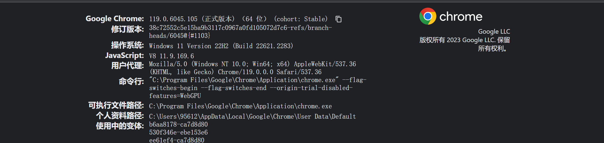
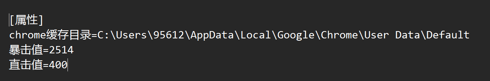
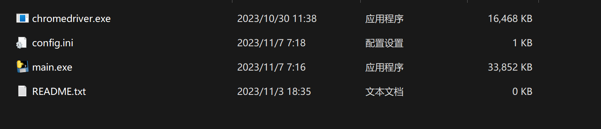
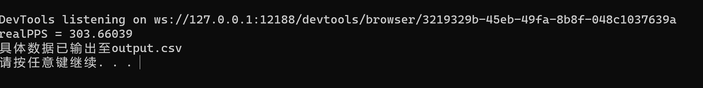
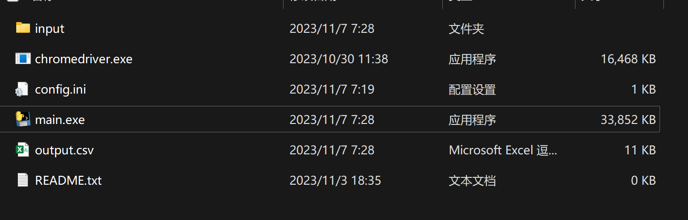

1. 打开你的chrome浏览器，输入 ``chrome://version/``，进入如下页面
2. 将个人资料路径复制下来放入ini文件，并输入黑魔法师的暴击直击值，配置文件最终应如下
3. 最终运行目录如下，此时需要关闭chrome浏览器（日后优化！），然后双击 ``main.exe``
4. 运行后会得到一个文件夹input和 ``output.csv``，详细数据会生成在output.csv中，而理论团伤pps会在命令行窗口展示（也就是那个黑框框）
